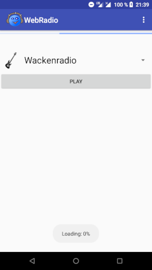
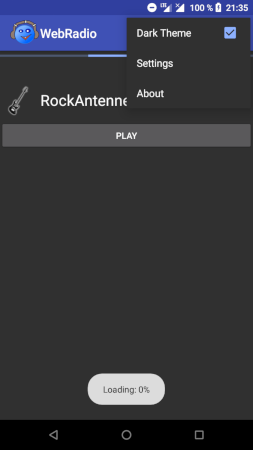
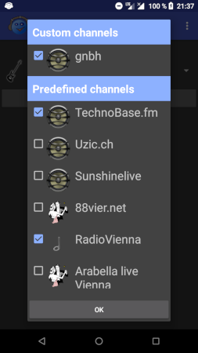
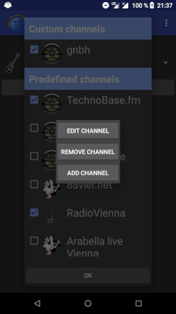
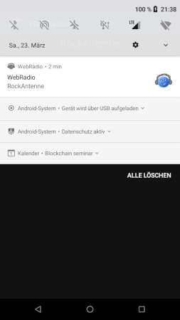

# WebRadio

This App plays network radio channels on Android.

You find a dark theme mode in the options menu.

Use the *Settings* to select defined channels.

With a long-press click: add and edit your custom channels.

Use a notification for fast app access:

Some predefined channels are already selectable.
The predefined List: `app/src/main/res/raw/channel_list.properties`

## Get the App

